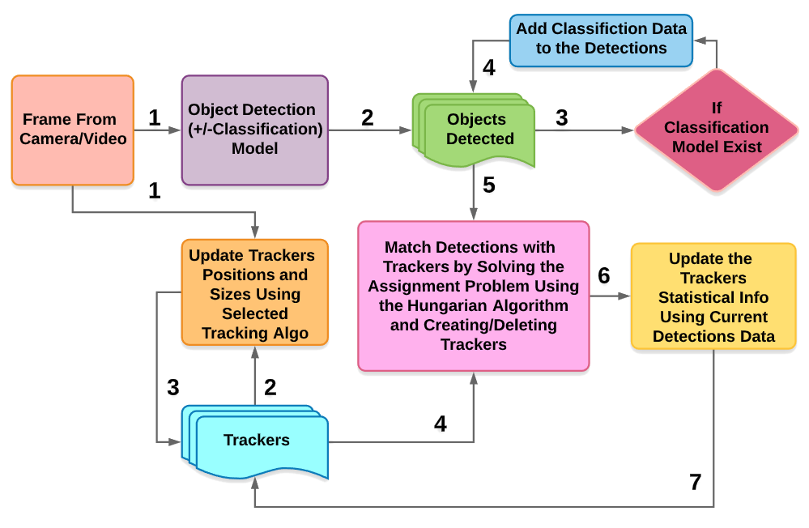
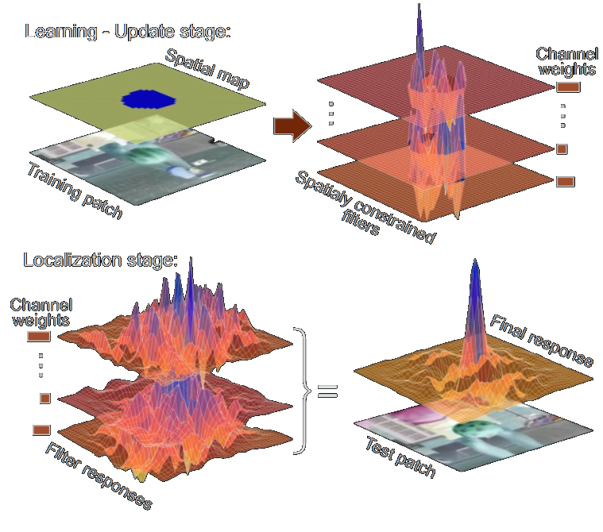
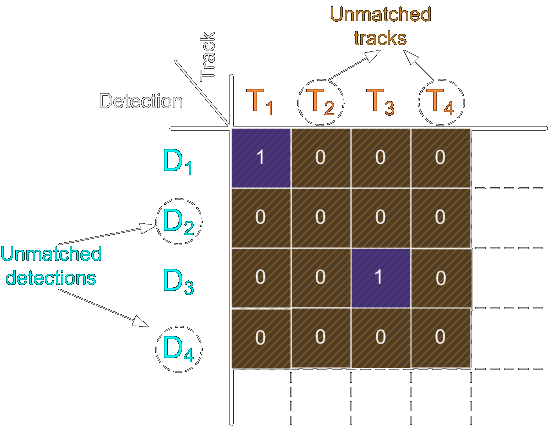

# TrackEverything

This project is an open-source package built in Python, it uses and combine the data form object detection models, classification models, tracking algorithms and statistics-based decision making. The project allows you to take any detection/classification models from any Python library like TensorFlow or PyTorch and add to them tracking algorithms and increase the accuracy using statistical data gathered from multiple frames.
<br>
Contributions to the codebase are welcome and I would love to hear back from
you if you find this package useful.
## How does it work
I recommend jumping to [this](#Overview) part first to understand the pipeline and the methods used.

## Installation & Requirements<br>[](https://www.python.org/downloads/release/python-370/)  []()
You can easily install the package with the Python Package Installer pip.


I used Python 3.8.1 but the code should work for Python 3.7+, additional requirements like NumPy will be checked and installed automatically.
```bash
# upgrade pip
python -m pip install --upgrade pip
# TrackEverything
python -m pip install TrackEverything
```
## How to Start

### Using a local webcam

Run the **GetCopsAndTrackCam.py** file and you should expect in a few seconds to see your webcam feed with the detection marking and boxes.

### Using a remote webcam

You can use a remote camera to get the data, I used a Raspberry Pi running MJPG-Streamer, you can follow [this](https://www.sigmdel.ca/michel/ha/rpi/streaming_en.html) guide.<br>
I also used an old laptop webcam and converted it to a USB camera, you can see how to do this [here](https://www.youtube.com/watch?v=C8pFkhkTvqo).
<p align="center"></p>
You can also add a GSM internet USB stick to the Pi and a custom charger to work in your car anywhere.
<p align="center"></p>

Once you have your stream URL, for example, this is on my local network <br>`http://192.168.14.197:8085/?action=stream` (you can add user+pass, SSL etc.), paste it to the **GetCopsAndTrackRemoteCam.py** file in the `Stream_url` var.<br>
Make sure to change the `H` and `W` vars accordingly since we are using multiprocessing and need to allocate the correct memory size.<br>
Run the **GetCopsAndTrackRemoteCam.py** file and you should expect in a few seconds to see your webcam feed and another feed with the detection marking and boxes.

## More Options

### Parameters and Actions Adjustment
You can edit parameters at the top of the file and disable the marking (to accelerate the detection process), as well as the `COPS_detected()` function that gets invoked when a cop/parking enforcement officer is detected in the frame with confidence over the `cop_precentage_invoke` variable. 

### Pick Different Object Detection Models
You can choose from [here](https://github.com/tensorflow/models/blob/master/research/object_detection/g3doc/tf1_detection_zoo.md) different object detection models and add them to `models/persons` and change the `model_name` var. Make sure to choose only models with boxes as output.

### Use a Custom Cop Classifier
You can make yourself a cop classifier using TensorFlow and images you collect and label them, just add to `models/cop_class`.<br>Make sure to use the sigmoid activation function on the output layer, and update the image reshaping sizes and the `filepathes` var.

## Future Improvements
* Add support for multiple cameras
* Add an option to run the entire project on the Raspberry Pi using TensorFlow Lite
* Add support for other countries
* Use GAN's to make more accurate models and pipelines

## Overview

This project uses the wonders of machine learning to detect cops and various law enforcement personal by using CNNs and tracking algorithms to gather statistics. This project is meant for educational purposes and is not to be misused.

## The Pipeline

The pipeline starts by receiving a series of images (frames) and outputs a list of tracker objects that contains the persons detected and the probability of them being a cop.
<p align="center"></p>

## Breaking it Down to 5 Steps

### 1st Step - Get All Detections in Current Frame 

First, we take the frame and passe it through an object detection model, I use the base of [this](https://github.com/tensorflow/models/tree/master/research/object_detection) Object Detection API(I modified the version for TF1 since the TF2 version only came out 10 days ago). This model is trained on the [COCO dataset](http://cocodataset.org/) which detects around 90 different objects, you can choose [here](https://github.com/tensorflow/models/blob/master/research/object_detection/g3doc/tf1_detection_zoo.md) some models with different CNN architectures. I used the model to give me all the persons detected in a frame. Later I filter out redundant overlapping detections using the Non-maximum Suppression (NMS) method.

### 2nd Step - Get Classification Probabilities for the Detected Persons

After we have the persons from step 1, we put them through a classification model to determine the probability of them being a cop. I used the `Xception` CNN architecture with some added layers to train this model, I used this architecture for its low parameters count since my GPU does not have much to offer. <p align="center"></p>Then, we create our `Detections` object list and which contains the positions boxes and the classification data.

### 3rd Step - Updated the Trackers Object List

We have a list of `Trackers` object which is a class that contains an [OpenCV CSRT tracker](https://docs.opencv.org/3.4/d2/da2/classcv_1_1TrackerCSRT.html) (A [Discriminative Correlation Filter Tracker with Channel and Spatial Reliability](https://arxiv.org/abs/1611.08461)). <p align="center"></p>
There are many more trackers types in OpenCV that we can choose from, here is a summary by Adrian Rosebrock: 
* **BOOSTING Tracker**: Based on the same algorithm used to power the machine learning behind Haar cascades (AdaBoost), but like Haar cascades, is over a  decade old. This tracker is slow and doesn’t work very well. Interesting only for legacy reasons and comparing other algorithms. (minimum OpenCV 3.0.0)
* **MIL Tracker**: Better accuracy than BOOSTING tracker but does a poor job of reporting failure. (minimum OpenCV 3.0.0)
* **KCF Tracker**: Kernelized Correlation Filters. Faster than BOOSTING and MIL. Similar to MIL and KCF, does not handle full occlusion well. (minimum OpenCV 3.1.0)
* **CSRT Tracker**: Discriminative Correlation Filter (with Channel and Spatial Reliability). Tends to be more accurate than KCF but slightly slower. (minimum OpenCV 3.4.2)
* **MedianFlow Tracker**: Does a nice job reporting failures; however, if there is too large of a jump in motion, such as fast moving objects, or objects that change quickly in their appearance, the model will fail. (minimum OpenCV 3.0.0)
* **TLD Tracker**: I’m not sure if there is a problem with the OpenCV implementation of the TLD tracker or the actual algorithm itself, but the TLD tracker was incredibly prone to false-positives. I do not recommend using this OpenCV object tracker. (minimum OpenCV 3.0.0)
* **MOSSE Tracker**: Very, very fast. Not as accurate as CSRT or KCF but a good choice if you need pure speed. (minimum OpenCV 3.4.1)
* **GOTURN Tracker**: The only deep learning-based object detector included in OpenCV. It requires additional model files to run. My initial experiments showed it was a bit of a pain to use even though it reportedly handles viewing changes well. (minimum OpenCV 3.2.0)

My tracker class also contains a unique ID, previous statistics about this ID and indicators for the accuracy of this tracker. In the first frame, this `Trackers` list is empty and then in step 4, it's being filled with new trackers matching the detected objects. If the `Trackers` list is not empty, in this step we update the trackers positions using the current frame and dispose of failed trackers.

### 4th Step - Matching Detection with Trackers

Using intersection over union (IOU) of a tracker bounding box and detection bounding box as a metric. We solve the linear sum assignment problem (also known as minimum weight matching in bipartite graphs) for the IOU matrix using the Hungarian algorithm (also known as Munkres algorithm). The machine learning package `scipy` has a build-in utility function that implements the Hungarian algorithm.
```bash
matched_idx = linear_sum_assignment(-IOU_mat)
```
The linear_sum_assignment function by default minimizes the cost, so we need to reverse the sign of IOU matrix for maximization.<br>
The result will look like this:<p align="center"></p>
For each unmatched detector, we create a new tracker with the detector's data, for the unmatched trackers we update the accuracy indicators for the tracker and remove any that are way off. For the matched ones, we update the tracker position to the more accurate detection box, we get the class data and average it with the previous 15 data points of the tracker (you can change that by setting the `num_avg` var).

### 5th Step - Decide What to Do

After step 4 the `Trackers` list is up to date with all the statistical and current data. The tracker class has a method to return the current classifications and confidence of those scores, we then update the detectors and iterate through them. A detector with low confidence score probably came from a tracker with not enough data (need at least `num_avg` data point to get the maximum score) or the detection is poor, we mark those in orange. A detector with a high enough confidence score will be green if it's not a cop, and red/blue if it is. The trackers that are not covered with detection boxes will show in cyan.
<p align="center"></p>
<p align="center"></p>

## Results

I only tested it on some videos I found online but the results are pretty good for cops and ok for parking officers. It requires more work and maybe a decent cop dataset to take the cop model further and into more countries.


